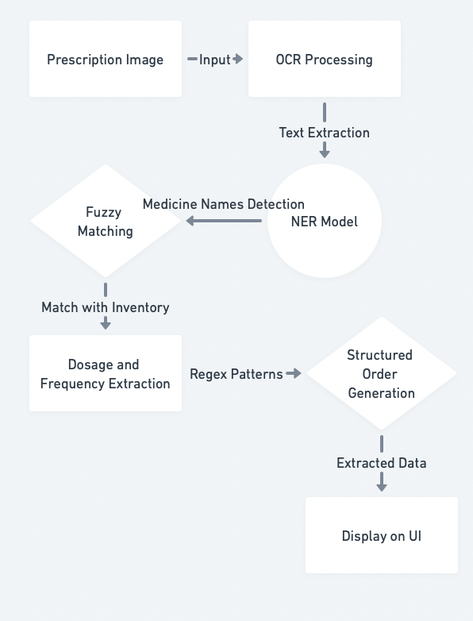
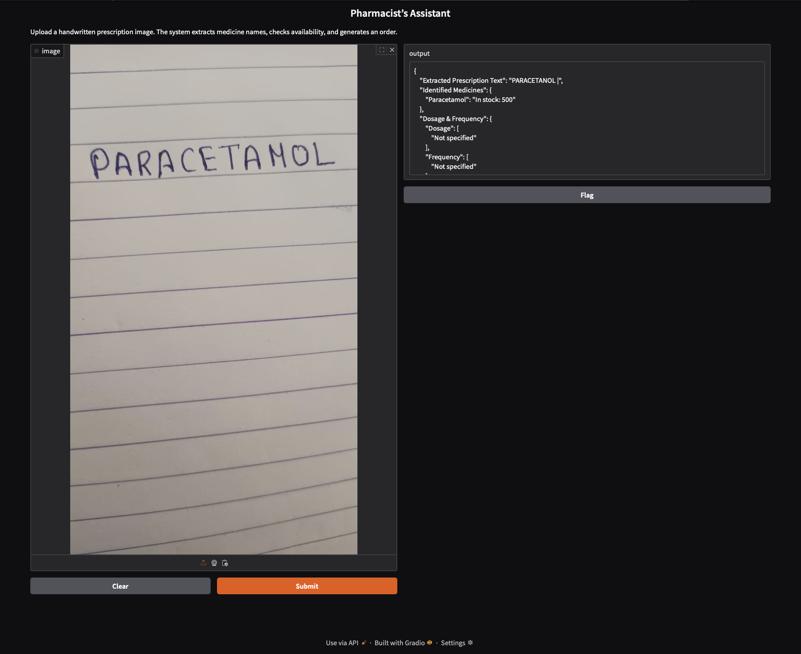
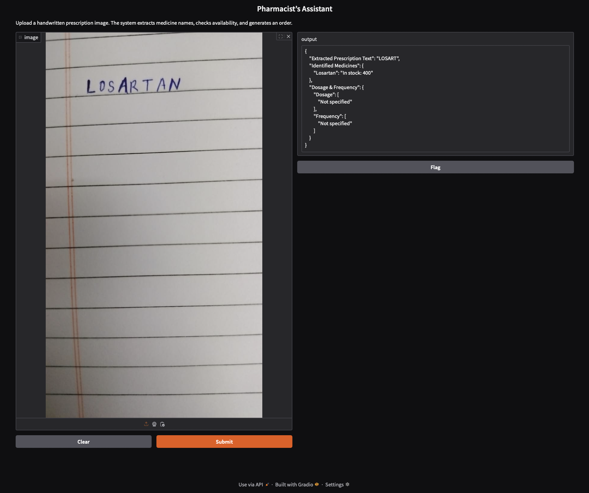
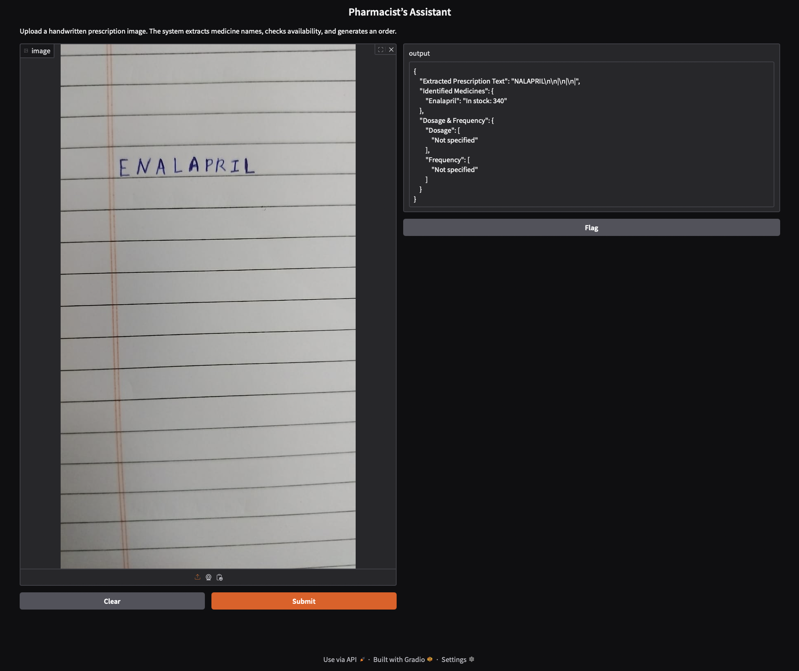

# 🏥 Pharmacist’s Assistant

A **Handwritten Prescription Processing System** that extracts medicine names from prescriptions using **OCR (Tesseract)**, identifies medicines using **NER (SpaCy)**, matches them with an **inventory**, and retrieves **stock availability, dosage, and frequency**.

## 📜 Project Overview

This system helps **pharmacists** by automating **prescription processing**:
1. Extracts text from **handwritten prescriptions** using **Tesseract OCR**.
2. Identifies **medicine names** using **Natural Language Processing (NER)**.
3. Matches medicines with an **inventory database**.
4. Extracts **dosage and frequency** using **Regex-based parsing**.
5. Provides a **structured order summary**.

## 🔄 System Flowchart

Below is the flowchart illustrating how the system processes a prescription:

---

## 💻 Environment Setup (MacBook (Apple Silicon))

Follow these steps to set up the environment for running this project.

### 1️⃣ Install Homebrew
If Homebrew is not already installed, download and install it. Verify the installation by checking the version.

### 2️⃣ Install Python and Set Up a Virtual Environment
Ensure that Python 3.10 or later is installed. 
"python3 --version"  # Ensure Python 3.10+ is installed
If not, install the latest version. 
"brew install python@3.11"
Then, create a virtual environment and activate it. 
"python3 -m venv venv source venv/bin/activate"

### 3️⃣ Install Dependencies
Install the required libraries, including Gradio, Tesseract OCR, SpaCy, Pandas, FuzzyWuzzy, and Pillow. Additionally, download the SpaCy English language model. 
"pip install gradio pytesseract spacy pandas fuzzywuzzy pillow
python -m spacy download en_core_web_sm"

### 4️⃣ Install Tesseract OCR
Install Tesseract OCR and verify the installation. If you encounter a "Tesseract Not Found" error, manually set the path in the code.
"brew install tesseract
tesseract --version"  # Verify installation

### 5️⃣ Run the Application
Once everything is set up, run the application to start processing handwritten prescriptions.
"python app.py"

# Prescription Processing Automation

## Sample Prescription Images & Output

### 📷 Sample 1 (Handwriting Style 1)

✔️ **Detected Medicines:** Paracetamol 

### 📷 Sample 2 (Handwriting Style 2)
 
✔️ **Detected Medicines:** Losartan  

### 📷 Sample 3 (Handwriting Style 3)
 
✔️ **Detected Medicines:** ENALAPRIL

## 🔮 Future Improvements
- 🔹 Train a custom NLP model for more accurate medicine detection  
- 🔹 Improve dosage extraction with AI-based parsing  
- 🔹 Connect with an online pharmacy database for real-time stock updates 
